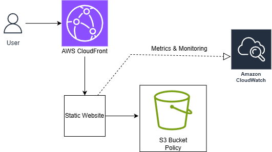

# 🌩️ Static Website Hosting on AWS using S3 and CloudFront (HTTPS Enabled)

This project demonstrates how to host a static website using **Amazon S3** and serve it securely through **Amazon CloudFront** using HTTPS. The setup uses AWS Free Tier and does **not require Route 53** or a custom domain.

---

## 🧭 Architecture
User → CloudFront (HTTPS) → S3 (Static Website)
- CloudFront: Provides CDN + SSL/TLS  
- S3: Hosts static website files  
- IAM: Manages permissions and access control  
- (Optional) ACM: For custom domain certificates  

---

## ⚙️ Services Used
AWS S3 | AWS CloudFront | AWS IAM | AWS Certificate Manager (optional)

---

## 🚀 Deployment Steps
1. Create an S3 bucket and enable static website hosting.  
2. Upload `index.html`, `style.css`, and other files.  
3. Add a bucket policy to allow public read access.  
4. Create a CloudFront distribution with your S3 website endpoint as origin.  
5. Enable HTTPS (Default CloudFront certificate).  
6. Access via the CloudFront domain (e.g., `https://d123abc.cloudfront.net`).  

---

## 📂 Folder Structure
aws-s3-cloudfront-static-website/
  ├── website/
  ├── aws/
  ├── architecture/
  └── README.md

---

## ✅ Verification
- Visit CloudFront URL → Should load your site via HTTPS  
- CloudFront status = “Deployed”  
- S3 bucket objects = Public (Read)  

---

## 🧰 Tools & Technologies
AWS S3 | CloudFront | IAM | HTML | CSS | GitHub  

---

## ✨ Author
**Gowri Suresh**  
GitHub: [Gowri0109](https://github.com/Gowri0109)  
LinkedIn: [linkedin.com/in/gowrisuresh01](https://www.linkedin.com/in/gowrisuresh01/)
